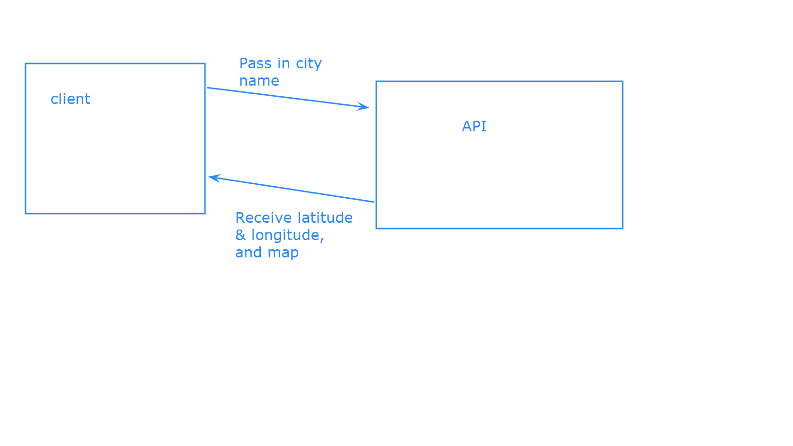
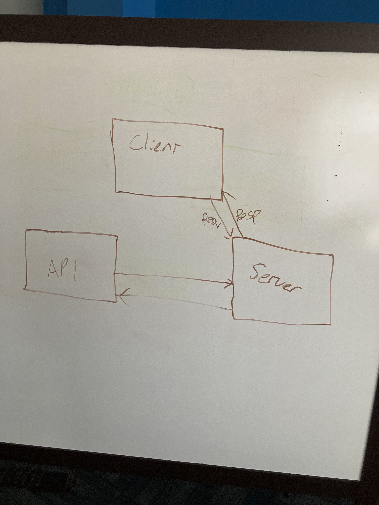
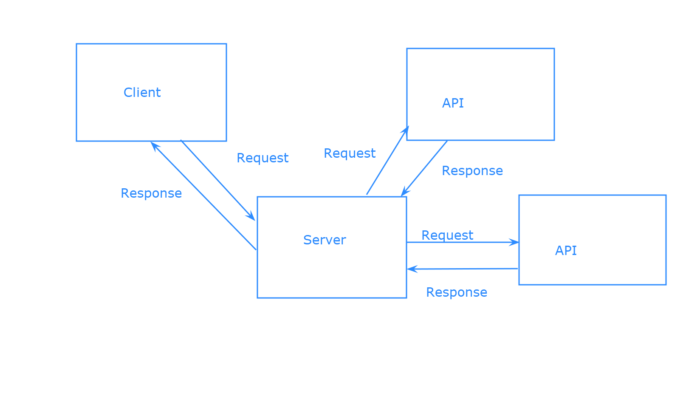
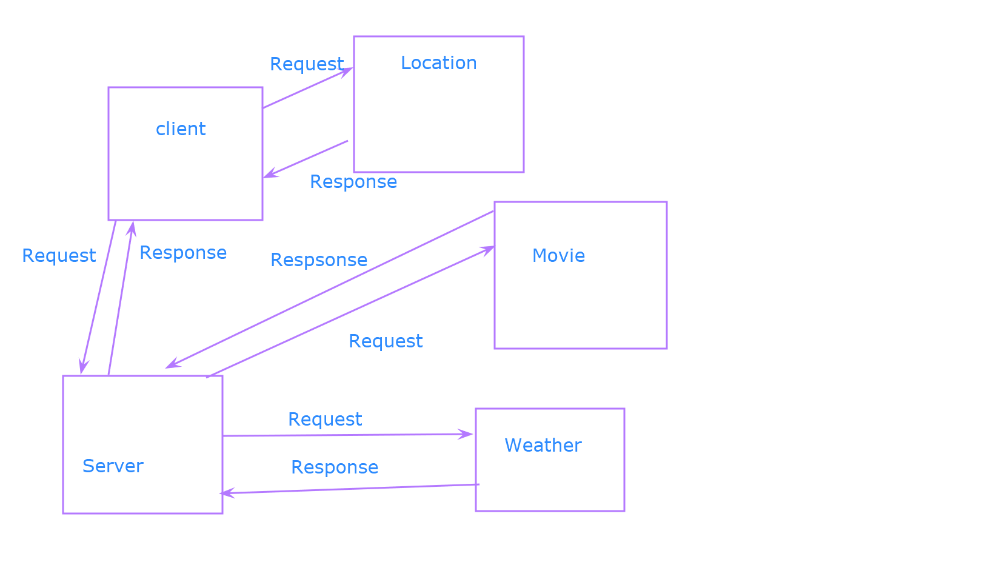
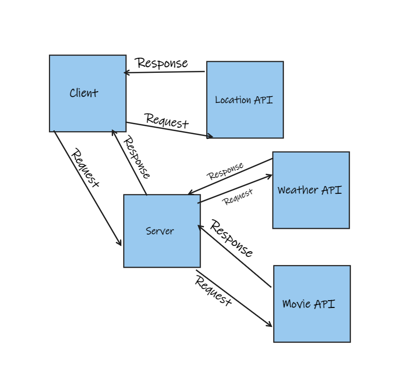

# City-Explorer

**Author**: Jordan Lindo
**Version**: 1.0.0 

## Overview

Take in a city name from the user and pass that to the API, and receive a city object that can be used to display a longitude and latitude 

## Getting Started

## Architecture

A React app using javaScript, Html, Css, Bootstrap, and git for version control, and Axios for access to the LocationIq API.

## Change Log

## Credit and Collaborations 

Allie Dunkel, Mary Kuriuki, Mike Pace, Varun Pradeep, Teresa Phillips, Daniel Frey

## Time Estimates

Name of feature: 1 Set up your React repo

Estimate of time needed to complete: 45 min

Start time: 1:45

Finish time: 2:47

Actual time needed to complete: 1 hour 2 min

Name of feature: 2 Locations

Estimate of time needed to complete: 1 hour

Start time: 3:00

Finish time: 8:25

Actual time needed to complete: 5 hours 25 min

Name of feature: 3 Map

Estimate of time needed to complete: 1 hour

Start time: 8:31

Finish time: 9:58

Actual time needed to complete: 1 hour 27 min

Name of feature: Errors

Estimate of time needed to complete: 1 hour

Start time: 3:15

Finish time: 4:25

Actual time needed to complete: 1 hour 10 min

Name of feature: Weather

Estimate of time needed to complete: 1 hour

Start time: 9:03

Finish time: 8:21

Actual time needed to complete: 23 hour 18 min

Name of feature: 3 Errors (revisited)

Estimate of time needed to complete: 1 hour

Start time: 8:10

Finish time: 9:13

Actual time needed to complete: 1 hour 3 min

Name of feature: 1 Weather(live)

Estimate of time needed to complete: 1 hour

Start time: 9:17

Finish time: 6:30

Actual time needed to complete: 9 hours 13 min

Name of feature: 2 Movies

Estimate of time needed to complete: 2 hours

Start time: 9:14

Finish time: _____

Actual time needed to complete: _____

Name of feature:____________________________

Estimate of time needed to complete: _____

Start time: _____

Finish time: _____

Actual time needed to complete: _____

Name of feature:____________________________

Estimate of time needed to complete: _____

Start time: _____

Finish time: _____

Actual time needed to complete: _____

Name of feature:____________________________

Estimate of time needed to complete: _____

Start time: _____

Finish time: _____

Actual time needed to complete: _____
